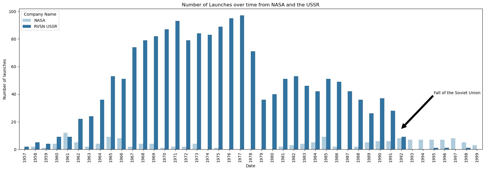
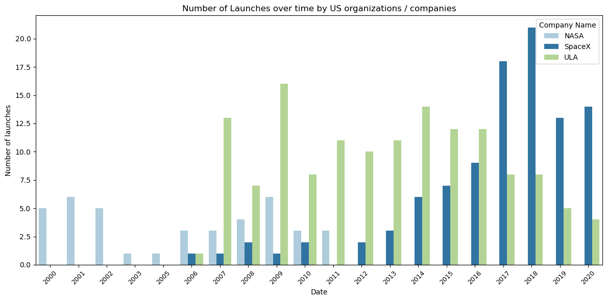
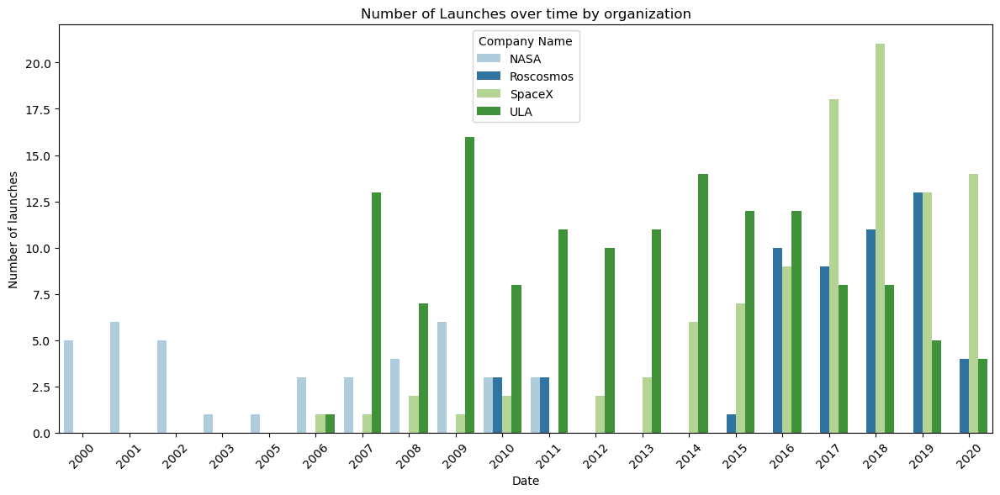

# The Fall of the Soviet Union and its effects on American space flight

 

## Table of Contents

1. [Overview](#overview)
2. [Proposal](#proposal)
3. [The Data](#the-data)
4. [Data Cleaning](#data-cleaning)
5. [Visualizations](#visualizations)
6. [Conclusion](#conclusion)

## Overview

The launch of Sputnik-1 marked the start of the Space Race between the United States and the Soviet Union. Throughout the years, the Soviets would dominate space, reaching new milestones left and right. The US would respond to Sputnik by racing to establish the National Aeronautics and Space Administration (NASA) 

## Proposal

The fall of the Soviet Union played a key role in allowing companies such as SpaceX and ULA to become major players in the commercial Space Launch industry. 

## The Data

The dataset titled 'All Space Missions from 1957' (found [here](https://www.kaggle.com/datasets/agirlcoding/all-space-missions-from-1957?resource=download)) The data can be found in one CSV file, and has a shape of 4,324 rows and 9 columns. Those columns were... 

- Two unnamed columns counting each row
- 'Company Name' denoting which particular company / organization launched each SLV
- 'Location' showing which launch site was used
- 'Datum' which had a string valued and a detailed down to the minute day and time of launch
- 'Detail' explaining what rocket was used / its payload
- 'Status Rocket' having two string values inside, the two being 'StatusActive' or 'StatusRetired'
- 'Rocket' which didn't provide much explanation for, just had numeric float values
- 'Status Mission' which like the Status Rocket column, had two values string. 'Success' or 'Failure'

## Data Cleaning

With these columns in mind all I wanted from the dataset was how many launches occured on or near the fall of the Soviet Union, separated by the individual organizations that launched. 

Originally, cleaning the data only took a little bit of effort. I started by dropping the first two unnamed columns that provided no value to the dataset. Then, I noticed the 'Datum' column was a string value with the dates including the date and time down to the minute of each launch. My first thought was to clean this column by only taking 

Overall, the dataset itself was not cluttered and did not have any major cleaning required. The biggest hurdle was changing the 'Datum' column into a more useful pandas datetime object. 

There were no outliers in this dataset.

## Visualizations

### NASA vs USSR comparison

### US based companies comparison

### Adding Russia to the mix

## Conclusion
